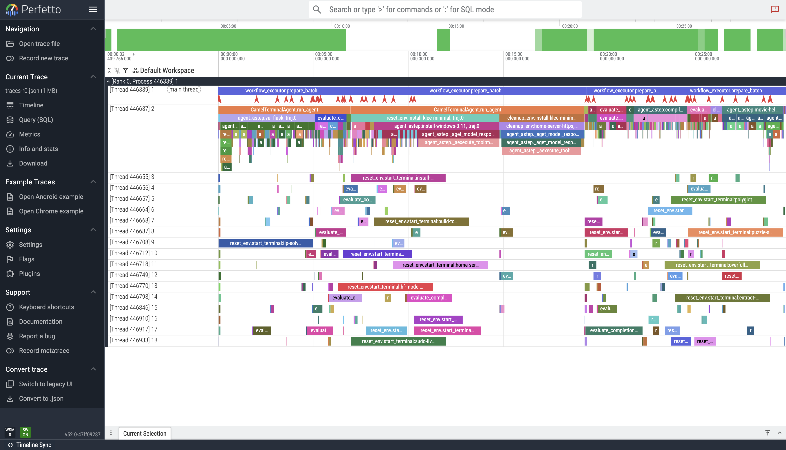
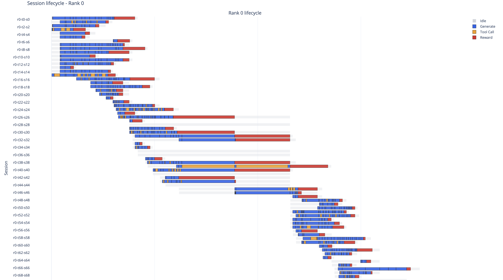

# Training a Terminal Agent in AReal framework

This is the folder for training & evaluation of terminal agent using `AReal` framework.

## Instruction for installation and running

### 1. Installation of necessary packages
```
git clone https://github.com/camel-ai/terminal_agent.git
cd terminal_agent
git checkout rllm
git submodule update --init --recursive
bash setup.sh
```

### 2. Downloading and converting dataset

  1. Raw dataset location and folder structure

      dataset should be located under `terminal_agent/dataset` folder

      - Folder structure

      ```
      <dataset_name>
      |__ <task_name_1>
              |__ task.yaml
              |__ Dockerfile
              ...
      |__ <task_name_2>
              |__ task.yaml
              |__ Dockerfile
              ....
      ```
  2. Convert dataset to parquet readable by datasets lib (i.e., a csv-like table)

  - Table format

```
task_name     instruction   task_path   ...
t1            i1            <path/to/task>
```
  
  3. We already have converted one from terminal-bench

  - Raw dataset:

      `dataset/tbench-tasks/`
    
  - Converted parquet

      `dataset/tbench-tasks_convert/train_filtered2.parquet`


  4. Quick setup instruction for existed datasets

  - In-house synth data:

```
# 1. Download raw data
python training/data_utils/download_data.py synth_data

# 2. Put prepared parquet path in config file 

train_dataset:
  path: synth_data_convert/train.parquet
```


### 3. For evaluation

  1. Using a independent sglang server (most convenient for debugging)

  a. start server

  ```
  cd training/tbench_areal_workflow
  python -m areal.launcher.local train.py --config configs/<config_name>.yaml   &> llm_server.log
  ```

  b. run evaluation script

modify the server address to match what's displayed in `llm_server.log`

  ```python
  os.environ["AREAL_LLM_SERVER_ADDRS"] = "127.0.1.1:16058" # <-- modify here
  ```

run the evaluation script

  ```bash
  python -u eval.py --config configs/<config_name>.yaml &> test_task.log
  ```

  2. Running script with self-started server

  ```bash
  python -m areal.launcher.local eval.py --config configs/<config_name>.yaml allocation_mode=sglang:d1p1t1+eval &> test_task.log
  ```

### 4. Visualize performance trace for each task & trajectory

After running the evaluation or train script

1. Visualize with finer details

```
python -m areal.tools.perf_trace_converter \
  logs/**/perf_tracer/traces-*.jsonl \
  logs/**/perf_tracer/merged.json
```

then open `merged.json` in chrom [Perfetto](https://ui.perfetto.dev/)



2. Visualize with separate task & traj

```
python -m areal.tools.plot_session_trace \
  logs/**/session_tracer/sessions-r*.jsonl \
  --consumer-batch-size 512 \
  --enable-lifecycle
```

then open the `html` file under the folder in browser

Example



### 5. Run training script

```bash
cd training/tbench_areal_workflow
WANDB_API_KEY=<> python -m areal.launcher.local train.py --config configs/config_8xh100-qwen3-8b.yaml &> train.log
```

#### 5.1 Separate server and training machine

1. Start rollout server on machine A

```bash
python -m areal.launcher.local train_remote_rollout.py --config configs/config_8xh100-qwen3-8b.yaml &> train.log
echo $AREAL_LLM_SERVER_ADDRS
```

2. Set sglang server port with machine A's IP address on machine B (training machine)

```bash
export AREAL_LLM_SERVER_ADDRS=<address1:port1>,<address2:port2>,...
```

```bash
cd training/tbench_areal_workflow
WANDB_API_KEY=<> python -m areal.launcher.local train_remote_rollout.py --config configs/config_8xh100-qwen3-8b.yaml &> train.log
```

### 6. Post-training evaluation

The checkpoint will be saved out at 

`${fileroot}/checkpoints/${USER}/${experiment_name}/${trial_name}/`

Replace the `model_path` in config to the path to checkpoint and run test script in **#3**

## Important note for Docker

### 1. Cleanup docker container
```
docker stop $(docker ps -a -q)
docker rm $(docker ps -a -q)
docker network prune -f
docker rmi -f $(docker images -aq)
```

### 2. ❗️Important: Docker address pool drained

If ever seen an error like this
```bash
STDERR:  client Pulling 
 client Warning pull access denied for tb__924__client, repository does not exist or may require 'docker login': denied: requested access to the resource is denied
 tb__924__client  Built
 Network 924-0a06b61b9dae4814b28d4ab98a5bf130-areal-run_default  Creating
 Network 924-0a06b61b9dae4814b28d4ab98a5bf130-areal-run_default  Error
failed to create network 924-0a06b61b9dae4814b28d4ab98a5bf130-areal-run_default: Error response from daemon: all predefined address pools have been fully subnetted

Error during agent execution: Command '['docker', 'compose', '-p', '924-0a06b61b9dae4814b28d4ab98a5bf130-areal-run', '-f', '/home/ubuntu/terminal_agent/dataset/terminal-bench-datasets/datasets/usaco/924/docker-compose.yaml', 'up', '-d']' returned non-zero exit status 1.

```

The error indicates the default docker address pool has been drained since a lot of docker container are spawned.
We can increase the docker network address config by modifying `daemon.json` file.

```bash

# DAEMON_JSON_CURRENT="/var/snap/docker/current/config/daemon.json"
# DAEMON_JSON_CURRENT="/etc/docker/daemon.json"   # 
sudo mkdir -p "$(dirname "$DAEMON_JSON_CURRENT")"
sudo cp "$DAEMON_JSON_CURRENT" "${DAEMON_JSON_CURRENT}.bak" 2>/dev/null || true

sudo tee "$DAEMON_JSON_CURRENT" > /dev/null <<'EOF'
{
  "default-address-pools": [
    { "base": "10.200.0.0/16", "size": 24 }
  ]
}
EOF

sudo snap restart docker
sudo systemctl restart docker
sudo systemctl status docker
docker network create testnet
docker network inspect testnet
```

### 3. Monitor docker status

`docker stats`: monitor the system usage of each container

`docker events`: streaming the docker command being requested

`grep overlay /proc/*/mountinfo | wc -l`: counts how many lines in all processes’ mount tables mention overlay

`ls -1 /var/lib/docker/overlay2 | wc -l`: counts how many directories (IDs) are stored in Docker’s overlay2 directory